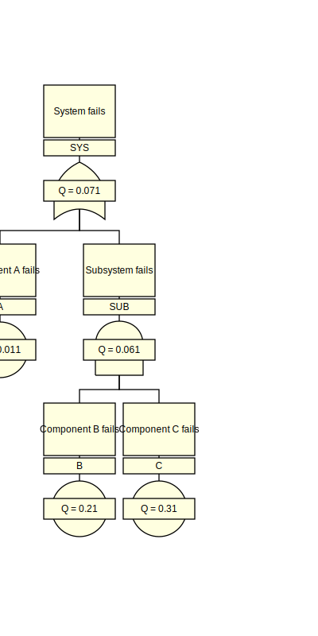

# Slow Fault Tree Analyser (SFTA)

A slow (also shitty) fault tree analyser inspired by the idea presented in
[Wheeler et al. (1977). Fault Tree Analysis Using Bit Manipulation.
IEEE Transactions on Reliability, Volume R-26, Issue 2.
<<https://doi.org/10.1109/TR.1977.5220060>>]


## Text-driven

SFTA reads a textual representation of a fault tree. For example:

```txt
Gate: SYS
- label: System fails
- type: OR
- inputs: A, SUB

Event: A
- label: Component A fails
- probability: 0.01

Gate: SUB
- label: Subsystem fails
- type: AND
- inputs: B, C

Event: B
- label: Component B fails
- probability: 0.2

Event: C
- label: Component C fails
- probability: 0.3
```

This allows for sensible diffing between two versions of a fault tree.


## Output

Output consists of:
- an events summary,
- a gates summary,
- cut set listings, and
- SVGs for all top gates and paged gates.

For the example above, we get the following SVG for the top gate `SYS`:




## Limitations

- Only supports coherent fault trees, which have only AND gates and OR gates.

- The probability or rate for a gate is approximated by simply summing the
  contributions from each minimal cut set (rare event approximation).
  The higher-order terms (subtraction of pairwise intersections, addition of
  triplet-wise intersections, etc.) have been neglected. This is conservative,
  as the first-order sum is an upper bound for the actual probability or rate.


## Usage

SFTA is currently a single-file script.

### Linux terminals, macOS Terminal, Git BASH for Windows

1. Make an alias for `sfta.py`
   in whatever dotfile you configure your aliases in:

   ```bashrc
   alias sfta='path/to/sfta.py'
   ```

2. Invoke the alias to analyse a fault tree text file:

   ```bash
   $ sfta [-h] [-v] ft.txt

   Perform a slow fault tree analysis.

   positional arguments:
     ft.txt         name of fault tree text file; output is written unto the
                    directory `{ft.txt}.out/`

   optional arguments:
     -h, --help     show this help message and exit
     -v, --version  show program's version number and exit
   ```

### Windows Command Prompt

1. Add the folder containing `sfta.py` to the `%PATH%` variable

2. Invoke `sfta.py` to analyse a fault tree text file:
   ```cmd
   > sfta.py [-h] [-v] ft.txt

   Perform a slow fault tree analysis.

   positional arguments:
     ft.txt         name of fault tree text file; output is written unto the
                    directory `{ft.txt}.out/`

   optional arguments:
     -h, --help     show this help message and exit
     -v, --version  show program's version number and exit
   ```


## License

**Copyright 2022 Conway** <br>
Licensed under the GNU General Public License v3.0 (GPL-3.0-only). <br>
This is free software with NO WARRANTY etc. etc., see [LICENSE]. <br>


[LICENSE]: LICENSE
