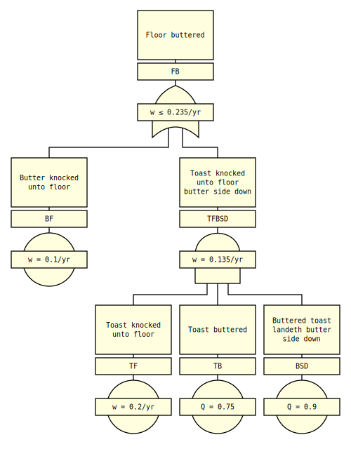

# Slow Fault Tree Analyser (SFTA)

A slow (also shitty) fault tree analyser inspired by the idea presented in
[Wheeler et al. (1977). Fault Tree Analysis Using Bit Manipulation.
IEEE Transactions on Reliability, Volume R-26, Issue 2.
<<https://doi.org/10.1109/TR.1977.5220060>>]


## Text-driven

SFTA reads a textual representation of a fault tree. For example:

```txt
- time_unit: yr

Gate: FB
- label: Floor buttered
- type: OR
- inputs: BF, TFBSD

Event: BF
- label: Butter knocked unto floor
- rate: 0.1

Gate: TFBSD
- label: Toast knocked unto floor butter side down
- type: AND
- inputs: TF, TB, BSD

Event: TF
- label: Toast knocked unto floor
- rate: 0.2

Event: TB
- label: Toast buttered
- probability: 0.75

Event: BSD
- label: Buttered toast landeth butter side down
- probability: 0.9
```

This allows for sensible diffing between two versions of a fault tree.


## Output

Output consists of:
- an events summary,
- a gates summary,
- cut set listings, and
- SVGs for all top gates and paged gates.

For the example above, we get the following SVG for the top gate `FB`:




## Limitations

- Only supports coherent fault trees, which have only AND gates and OR gates.

- The probability or rate for a gate is approximated by simply summing the
  contributions from each minimal cut set (rare event approximation).
  The higher-order terms (subtraction of pairwise intersections, addition of
  triplet-wise intersections, etc.) have been neglected. This is conservative,
  as the first-order sum is an upper bound for the actual probability or rate.


## Installation

```bash
$ pip3 install sfta
```


## Usage

```bash
$ sfta [-h] [-v] ft.txt

Perform a slow fault tree analysis.

positional arguments:
  ft.txt         name of fault tree text file; output is written unto the
                 directory `{ft.txt}.out/`

optional arguments:
  -h, --help     show this help message and exit
  -v, --version  show program's version number and exit
```


## License

**Copyright 2022–2024 Conway** <br>
Licensed under the GNU General Public License v3.0 (GPL-3.0-only). <br>
This is free software with NO WARRANTY etc. etc., see [LICENSE]. <br>


[LICENSE]: LICENSE
